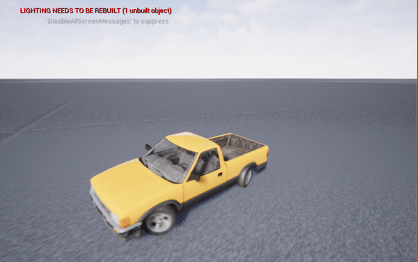

# Vehicle in Unreal

Learning to build cars in Unreal Engine
- Currently it uses vehicle wheeled class for controls
- Vehicle can be controlled via WASD on floor and in air.

## Demo (UE4)

## References
- https://continuebreak.com/articles/how-rig-vehicle-blender-28-ue4/
- https://www.youtube.com/watch?v=qCSN1oScO4E
